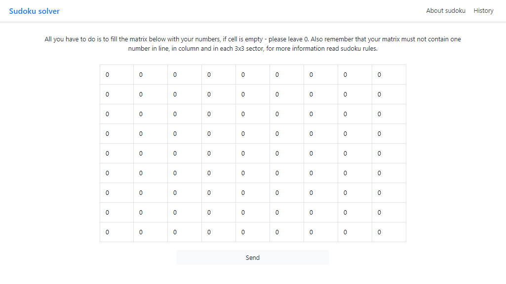

This is the app that represents sudoku solver site. Fully test covered. 

To run this app locally:

    git clone https://github.com/artemchege/Sudoku_app.git
    python manage.py runserver
    
To run in docker: 

    docker build -t sudoku_app .
    docker run -p 8000:8000 sudoku_app python manage.py runserver 0.0.0.0:8000
    
If you run on server do not forget to edit ALLOWED_HOSTS, and make debug=False. 

Future improvements: 

1. add celery (maybe)